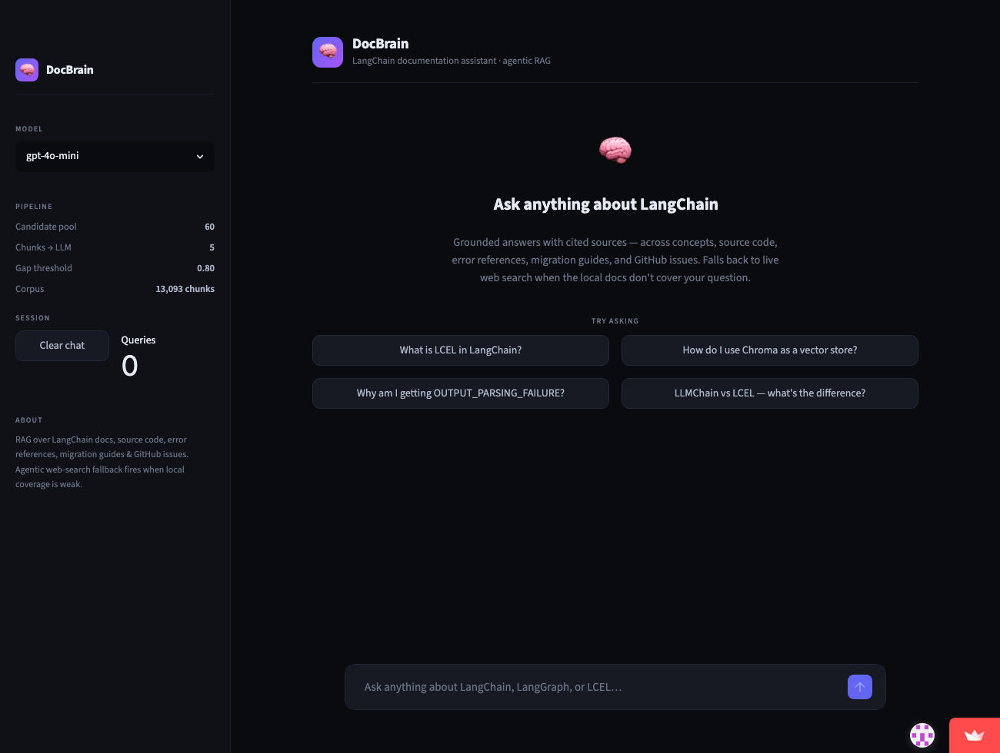
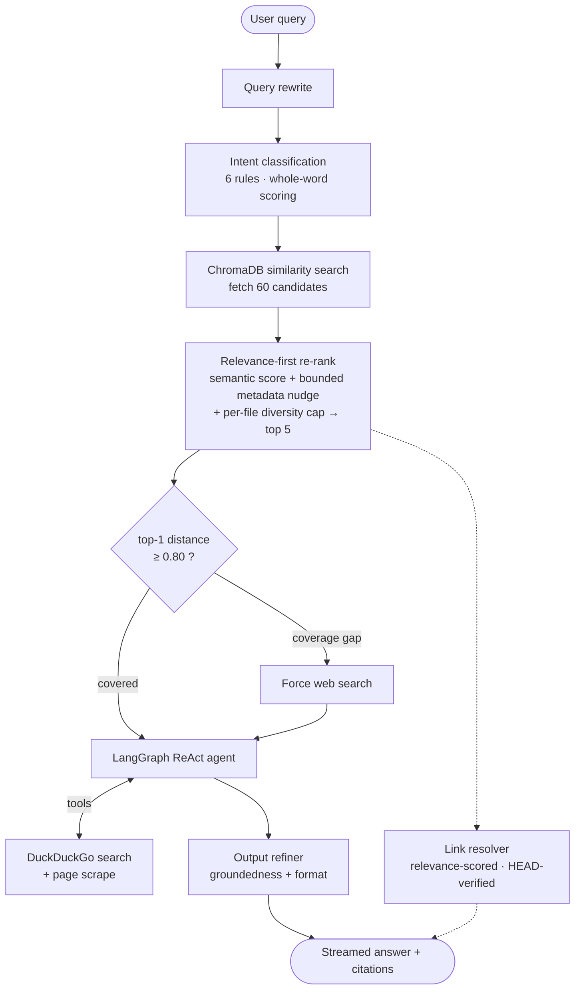

# 🧠 DocBrain — AI-Powered Developer Documentation Assistant

> *"Stop reading docs. Start asking questions."*

[](https://docbrain.streamlit.app)


DocBrain is a **RAG (Retrieval-Augmented Generation)** application that lets developers query LangChain documentation in natural language. Instead of skimming pages of docs, just ask — and get precise, cited answers backed by real documentation.

**🔗 Live demo: [docbrain.streamlit.app](https://docbrain.streamlit.app)**



What makes it more than a RAG wrapper:

- **Retrieval is measured, not asserted** — a labelled golden set and a documented v4→v5 re-ranking improvement (see [Evaluation](#-evaluation)).
- **Citations are verified** — every source link is relevance-scored *and* HEAD-checked; URLs the model invents are stripped.
- **The agent knows when to leave the corpus** — a distance threshold calibrated on the golden set forces a live web search when local docs don't cover the question.

---

## ✨ Features

Every feature below is implemented in the code referenced beside it.

- 🎯 **Relevance-first re-ranking** — ranks on semantic similarity; document priority and query intent are only a *bounded* tiebreaker (max ±0.18, never enough to outrank a better-matching chunk). — `src/retriever.py`
- 🧭 **Intent routing** — a keyword classifier tags each query (concept / code / error / migration / LangGraph / integration) and routes it to a matching prompt template and preferred doc types. — `src/retriever.py`, `src/prompt_templates.py`
- 📉 **Calibrated coverage-gap detection** — the top chunk's *absolute* distance is checked against a threshold (`≥ 0.80`) fit on the golden set; above it, the agent is forced to web-search instead of answering from weak context. — `src/retriever.py`
- 🤖 **Agentic web fallback** — a LangGraph **ReAct** agent with two tools, DuckDuckGo search and a BeautifulSoup page scraper, used only when local coverage is weak. — `src/chain.py`, `src/tools.py`
- 📎 **Verified source links** — links are scored for topical relevance to the question and HEAD-checked before display; unverified URLs are stripped from the answer body. — `src/link_resolver.py`, `src/output_refiner.py`
- ✍️ **Output refinement** — a post-generation pass runs a groundedness check on answers that contain code, plus format checks. — `src/output_refiner.py`
- ⚡ **Streaming chat UI** — native Streamlit chat with token streaming and inline source pills. — `app.py`
- 📦 **Zero-setup demo** — the prebuilt vector index auto-downloads on first run; no ingestion required. — `src/bootstrap_db.py`

---

## 🏗️ Architecture



**The request lifecycle, stage by stage:**

1. **Query rewrite** — an LLM pass expands abbreviations (`LCEL` → *LangChain Expression Language*) and resolves vague references using chat history, before retrieval runs. — `chain.py: rewrite_query`
2. **Intent classification** — six keyword rules are scored on whole-word matches (no substring false-positives); the top-scoring intent selects the prompt template and the preferred/penalised doc types. — `retriever.py: classify_intent`
3. **Candidate retrieval** — a similarity search pulls the top **60** chunks *with their distances* from ChromaDB (the distance is the relevance signal a metadata-only reranker throws away). — `retriever.py` (`FETCH_K = 60`)
4. **Relevance-first re-rank** — distances are min-max normalized in-pool to a `[0,1]` relevance score (the dominant signal); a small metadata nudge (priority + intent-preferred `doc_type`, capped at **+0.18 / −0.10**) only breaks ties; a **max-2-chunks-per-source-file** cap forces topical diversity; the top **5** go to the LLM. — `retriever.py: rerank_results`
5. **Coverage-gap check** — the top chunk's *absolute* `raw_distance` is compared to the calibrated **0.80** threshold. Above it, the corpus probably doesn't cover the question, so the agent is pushed to the web-search tool rather than trusting weak context. — `retriever.py`
6. **Prompt routing + generation** — the intent's template is filled with the ranked context and history and handed to a **LangGraph ReAct agent**; on a coverage gap (or thin context) the agent calls the DuckDuckGo / scrape tools live. — `chain.py`, `prompt_templates.py`
7. **Output refinement** — a groundedness check (an LLM call, run only when the answer contains code — the highest-risk hallucination surface) plus cheap format checks; any unverified inline URL is stripped. — `output_refiner.py`
8. **Link resolution** — independently, the retrieved docs (plus any pages the agent actually visited) are scored for topical overlap with the question and HEAD-verified into the source pills shown under the answer. — `link_resolver.py`
9. **Streaming** — tokens stream to the Streamlit UI through one native renderer; the verified pills and a meta caption (`intent · latency · model`) render in the same message bubble. — `app.py`

**The corpus** is **13,093 chunks** built from LangChain / LangGraph conceptual docs (`.mdx`), `langchain-core` source (`.py`), curated integrations, error references, migration guides, and GitHub issues (~41% of the corpus). Chunking is per-category, with a `[Category | Framework | Topic | File]` header prepended to each chunk before embedding for sharper semantic identity. — `src/ingest.py`

---

## 🛠️ Tech Stack

| Layer | Choice |
|-------|--------|
| **LLM** | OpenAI `gpt-4o-mini` (default) · `gpt-4o` · `gpt-4-turbo` |
| **Embeddings** | OpenAI `text-embedding-3-small` |
| **Vector store** | ChromaDB (persistent, HNSW) — 13,093 chunks |
| **Agent** | LangGraph ReAct (`create_react_agent`) |
| **Orchestration** | LangChain (`core` / `community` / `openai`) |
| **Agent tools** | `ddgs` (DuckDuckGo search) · BeautifulSoup (page scrape) |
| **UI** | Streamlit (native chat + token streaming) |
| **Evaluation** | Custom harness — `hit@k`, `recall@k`, `MRR` (pure set comparison, no LLM judge) |
| **Deploy** | Streamlit Community Cloud + GitHub Releases (prebuilt index) |
| **Language** | Python 3.11 |

---

## 🧪 Evaluation

Retrieval quality is **measured, not asserted.** `src/evaluation.py` scores retrieval against a hand-labelled golden set (`eval_data/golden_set.jsonl` — **32 covered + 6 coverage-gap** questions) at **source-file granularity**. That granularity is deliberate: 13,093 chunks aren't hand-labellable, chunk IDs shift on every re-embed, and the question that actually matters is *"did we retrieve from the right document?"*. The metrics are pure set comparison — no LLM judge — so they're **deterministic, free, and reproducible.**

```bash
python -m src.evaluation --k 5 --label v5
```

### Results (k = 5)

| Version | hit@5 | recall@5 | MRR |
|---------|:-----:|:--------:|:---:|
| v4 — re-rank on metadata alone | 0.875 | 0.833 | **0.788** |
| **v5 — relevance-first re-rank** | **0.906** | **0.865** | 0.745 |

**The v4→v5 story** (the reason this section exists): v4 re-ranked candidates on metadata *alone* — it never looked at the query's semantic similarity, so a weakly-relevant "priority-1" chunk reliably outranked a highly-relevant one. The eval harness caught it, v5 made semantic relevance the dominant signal, and **hit@5 and recall@5 both rose** — the right document is now retrieved more often. **MRR dipped slightly** (the right doc is found more, but ranked *first* a little less often), which points squarely at ranking *order* — a **cross-encoder reranker** — as the next lever.

### Coverage-gap detection

Questions the corpus genuinely can't answer (e.g. *"What is LCEL?"* — the scrape contains no LCEL explainer) are scored on a *different* question: **did the system notice it couldn't answer?** An absolute `raw_distance` threshold is fit by sweeping for the best Youden's *J*:

- **Threshold `raw_distance ≥ 0.80`** catches **6/6** gap questions (sensitivity 1.0) at **12/32** false alarms on covered questions (specificity 0.625, *J* = 0.625).
- It's deliberately tuned to favour recall on gaps — a needless web search is cheaper than a confident hallucination — and it's **wired into the retriever** to force the web-search fallback (`retriever.py: GAP_DISTANCE_THRESHOLD`).

> Answer-quality metrics (faithfulness, answer-relevancy) need an LLM judge and are **not** implemented yet — they're tracked in the [Roadmap](#-roadmap). Retrieval is measured first because it's upstream of everything else.

---

## 🚀 Quickstart

```bash
git clone https://github.com/Utsav-tala/DocBrain.git
cd DocBrain
python -m venv venv && source venv/bin/activate    # Windows: venv\Scripts\activate
pip install -r requirements.txt
export OPENAI_API_KEY=sk-...                        # or copy .env.example → .env
streamlit run app.py
```

On first launch the prebuilt vector index (~100 MB) **auto-downloads** from the GitHub Release — no ingestion needed. Then open **http://localhost:8501**.

📖 **Full instructions** — configuration, the evaluation harness, and rebuilding the index from scratch — are in **[SETUP.md](SETUP.md)**.

---

## 📁 Project Structure

```
DocBrain/
├── app.py                  # Streamlit entry point (chat UI + streaming)
├── ui_components.py        # UI helpers (CSS, hero, source pills)
├── requirements.txt        # Lean, pinned serving dependencies
├── requirements-dev.txt    # + ingest & evaluation tooling
├── SETUP.md                # Clone / configure / run / evaluate guide
├── src/
│   ├── bootstrap_db.py     # Lazy-downloads the prebuilt index on first run
│   ├── ingest.py           # Document ingestion & chunking pipeline
│   ├── retriever.py        # Intent routing + relevance-first re-rank + gap signal
│   ├── chain.py            # LangGraph ReAct agent + streaming
│   ├── prompt_templates.py # Intent-specific prompt templates
│   ├── output_refiner.py   # Groundedness / format / link sanitization
│   ├── link_resolver.py    # Relevance-scored, HEAD-verified source links
│   ├── tools.py            # Agent tools (DuckDuckGo search, page scrape)
│   └── evaluation.py       # Retrieval eval harness — hit@k, recall@k, MRR
├── eval_data/              # Golden set (tracked — backs the eval numbers)
├── results/               # Saved eval reports (tracked)
├── data/                   # ⚠️ Gitignored — raw corpus (see SETUP.md, Path B)
└── db/                     # ⚠️ Gitignored — vector store (auto-downloaded)
```

---

## ⚠️ Limitations

Honest and open:

- **Gap detection is calibrated on only 6 gap questions** — high recall, but ~1/3 false alarms on covered questions. A larger golden set would tighten it.
- **Dense retrieval is weak on exact symbols** (`LLMChain`, `AttributeError`) — hybrid search (BM25 + dense) is the planned fix.
- **Answer-quality isn't measured yet** — retrieval is scored; faithfulness/relevancy are future work.
- **Session history is in-memory** — conversations reset when the server restarts.

---

## 🗺️ Roadmap

- [ ] **Hybrid search (BM25 + dense)** — fix dense retrieval's blind spot on exact symbols
- [ ] **Cross-encoder reranker** — targets the MRR dip (re-ranking *order*, not recall)
- [ ] **Grow the golden set (38 → ~150)** — tighten the gap threshold's specificity
- [ ] **Answer-quality eval** — faithfulness + answer-relevancy (needs an LLM judge)
- [ ] **Persistent conversation memory** — survive restarts
- [x] Relevance-first re-ranking · calibrated web-search fallback · streaming UI · hosted demo

---

## 📄 Environment Variables

Copy `.env.example` → `.env` and fill in your values. **Never commit `.env`.**

| Variable | Required | Description |
|----------|:--------:|-------------|
| `OPENAI_API_KEY` | ✅ | Chat model responses + embeddings |
| `GITHUB_TOKEN` | — | Ingest GitHub issues (rebuild path only; scope `public_repo`) |
| `DOCBRAIN_DB_URL` | — | Override the prebuilt-index download URL |

See [`.env.example`](.env.example) for the annotated template and [SETUP.md](SETUP.md) for full setup.

---

## 📝 License

MIT License — see [LICENSE](LICENSE) for details.
